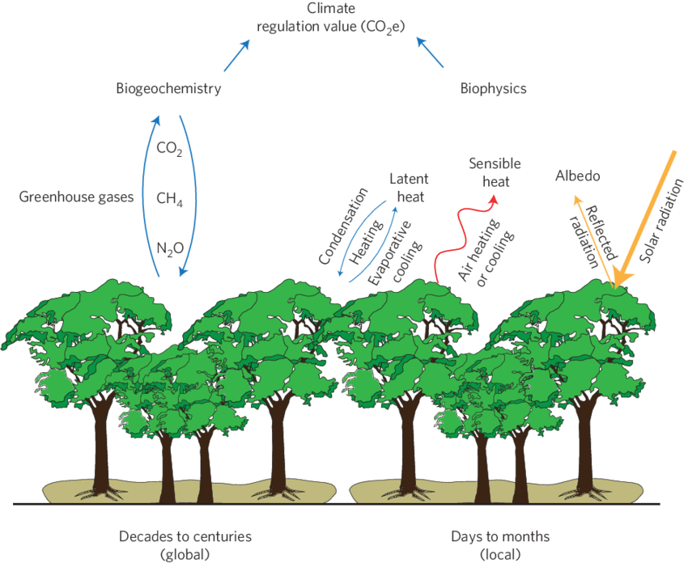

# Atmosphere and Climate Regulation

Life on earth plays a critical role in regulating the earth's physical, chemical, and geological properties, from
influencing the chemical composition of the atmosphere to modifying climate.
About 3.5 billion years ago, early life forms (principally cyanobacteria) helped create an oxygenated
atmosphere through photosynthesis, taking up carbon dioxide from the atmosphere and releasing oxygen. Over time, these organisms altered the composition of the atmosphere, increasing oxygen levels, and paved the way for organisms that use oxygen as an energy source
(aerobic respiration), forming an atmosphere similar to that existing today.
Carbon cycles on the planet between the land, atmosphere, and oceans through a combination of physical,
chemical, geological, and biological processes. One key way biodiversity influences the
composition of the earth's atmosphere is through its role in carbon cycling in the oceans, the largest reservoir
for carbon on the planet. In turn, the atmospheric composition of
carbon inuences climate. Phytoplankton (or microscopic marine plants) play a central role in regulating
atmospheric chemistry by transforming carbon dioxide into organic matter during photosynthesis. This
carbon-laden organic matter settles either directly or indirectly (after it has been consumed) in the deep
ocean, where it stays for centuries, or even thousands of years, acting as the major reservoir for carbon
on the planet. In addition, carbon also reaches the deep ocean through another biological process of the
formation of calcium carbonate, the primary component of the shells in two groups of marine organisms
coccolithophorids (a phytoplankton) and foraminifera (a single celled, shelled organism that is abundant in
many marine environments). When these organisms die, their shells sink to the bottom or dissolve in the
water column. This movement of carbon through the oceans removes excess carbon from the atmosphere
and regulates the earth's climate.
Over the last century, humans have changed the atmosphere's composition by releasing large amounts of
carbon dioxide. This excess carbon dioxide, along with other 'greenhouse' gases, is believed to be heating
up our atmosphere and changing the world's climate, leading to 'global warming'. There has been much
debate about how natural processes, such as the cycling of carbon through phytoplankton in the oceans, will
respond to these changes. Will phytoplankton productivity increase and thereby absorb the extra carbon
from the atmosphere? Recent studies suggest that natural processes may slow the rate of increase of carbon
dioxide in the atmosphere, but it is doubtful that either the earth's oceans or its forests can absorb the
entirety of the extra carbon released by human activity.
# Land Use Change and Climate Regulation
The energy source that ultimately drives the earth's climate is the sun. The amount of solar radiation
absorbed by the earth depends primarily on the characteristics of the surface. Although the link between
solar absorption, thermodynamics, and ultimately climate is very complex, newer studies indicate that
vegetation cover and seasonal variation in vegetation cover affects climate on both global and local scales.
New generations of atmospheric circulation models are increasingly able to incorporate more complex data
related to these parameters. Besides regulating the atmosphere's composition, the
extent and distribution of diferent types of vegetation over the globe modifies climate in three main ways:
• affecting the reffectance of sunlight (radiation balance);
• regulating the release of water vapor (evapotranspiration); and
• changing wind patterns and moisture loss (surface roughness).
The amount of solar radiation refected by a surface is known as its albedo; surfaces with low albedo reect
a small amount of sunlight, those with high albedo refect a large amount. Different types of vegetation have
different albedos; forests typically have low albedo, whereas deserts have high albedo. Deciduous forests are
a good example of the seasonal relationship between vegetation and radiation balance. In the summer, the
leaves in deciduous forests absorb solar radiation through photosynthesis; in winter, after their leaves have
fallen, deciduous forests tend to refect more radiation. These seasonal changes in vegetation modify climate
in complex ways, by changing evapotranspiration rates and albedo.
Vegetation absorbs water from the soil and releases it back into the atmosphere through evapotranspiration, which is the major pathway by which water moves from the soil to the atmosphere. This release of
water from vegetation cools the air temperature. In the Amazon region, vegetation and climate is tightly
coupled; evapotranspiration of plants is believed to contribute an estimated fifty percent of the annual
rainfall. Deforestation in this region leads to a complex feedback mechanism, reducing
evapotranspiration rates, which leads to decreased rainfall and increased vulnerability to fire.
Deforestation also influences the climate of cloud forests in the mountains of Costa Rica. The Monteverde
Cloud Forest harbors a rich diversity of organisms, many of which are found nowhere else in the world.
However, deforestation in lower-lying lands, even regions over 50 kilometers way, is changing the local climate,
leaving the "cloud" forest cloudless. As winds pass over deforested lowlands, clouds
are lifted higher, often above the mountaintops, reducing the ability for cloud forests to form. Removing
the clouds from a cloud forest dries the forest, so it can no longer support the same vegetation or provide
appropriate habitat for many of the species originally found there. Similar patterns may be occurring in
other, less studied montane cloud forests around the world.
Diferent vegetation types and topographies have varying surface roughness, which change the flow
of winds in the lower atmosphere and in turn influences climate. Lower surface roughness also tends to
reduce surface moisture and increase evaporation. Farmers apply this knowledge when they plant trees to
create windbreaks. Windbreaks reduce wind speed and change the microclimate,
increase surface roughness, reduce soil erosion, and modify temperature and humidity. For many field crops,
windbreaks increase yields and production effciency. They also minimize stress on livestock from cold winds.

